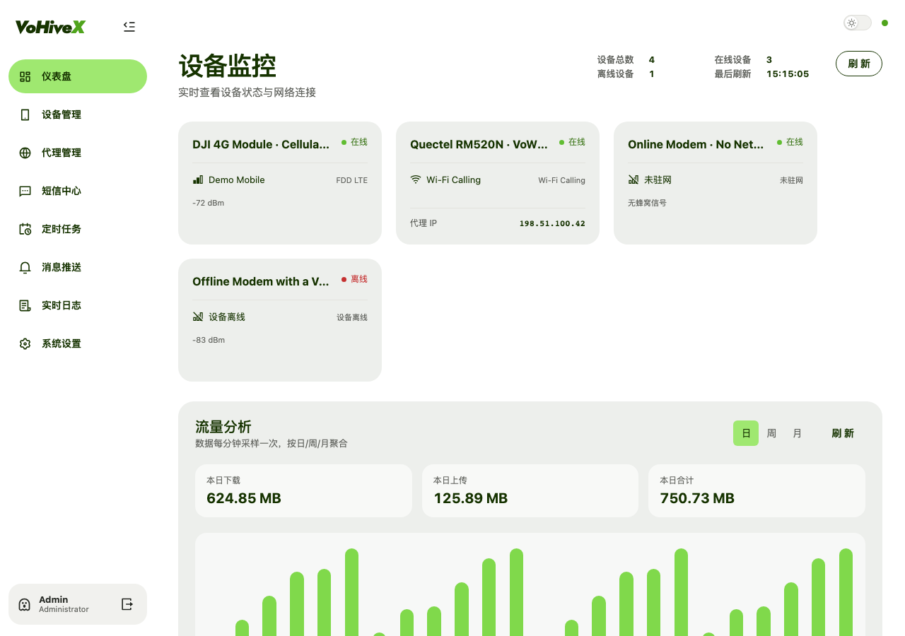
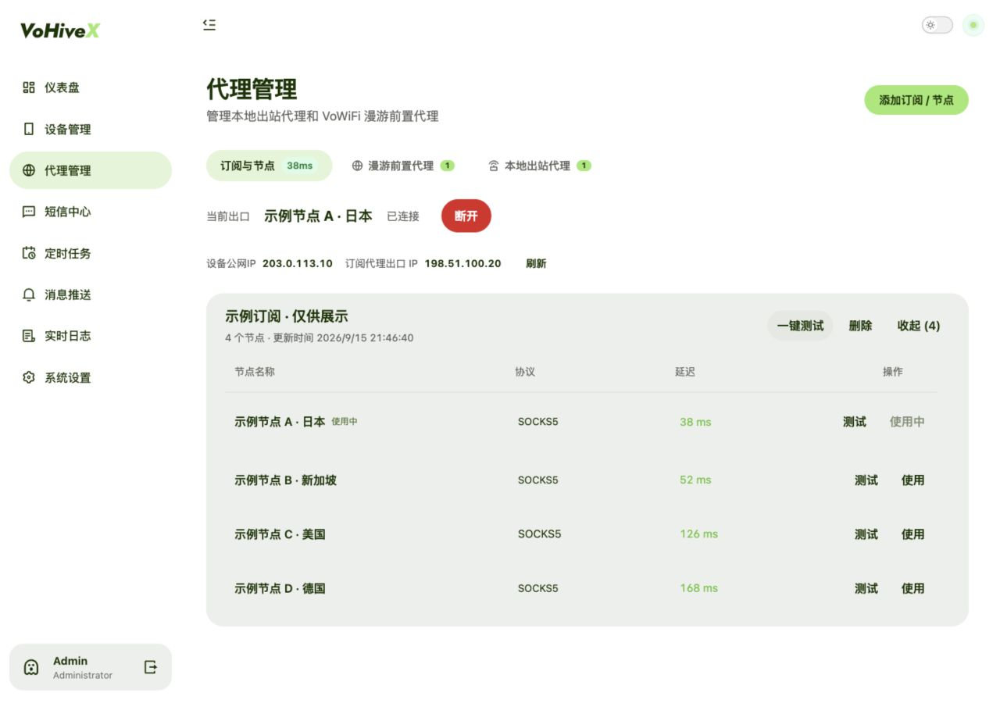
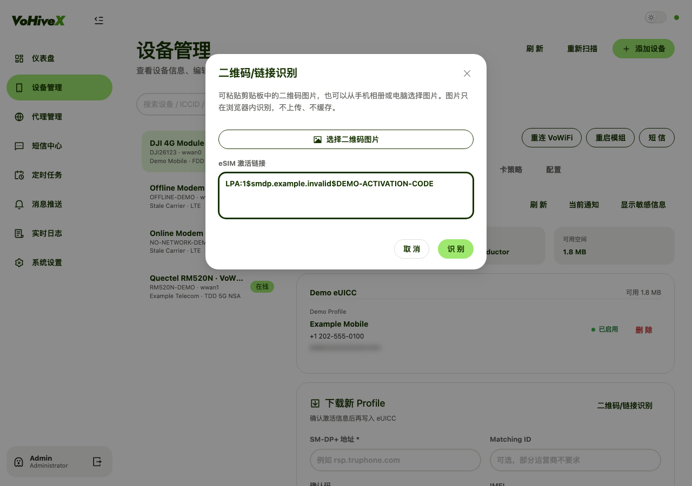
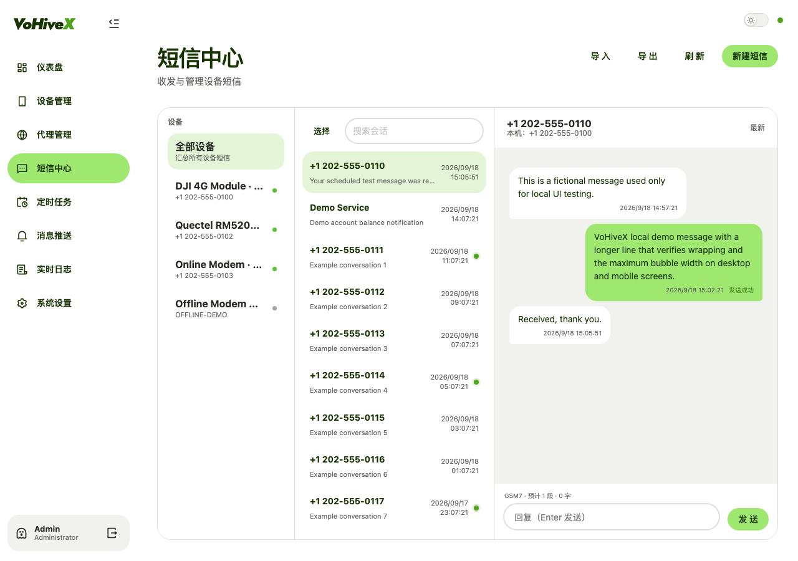
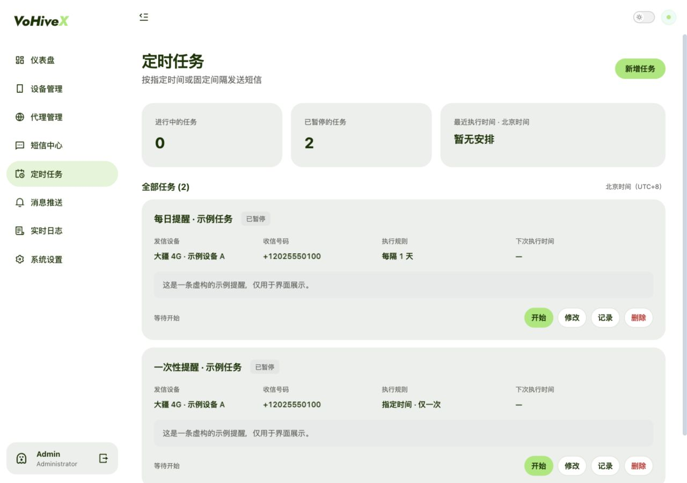

<p align="center">
  <a href="https://github.com/iniwex5/vohive">VoHive</a> ·
  <a href="https://go.dev/">Go</a> ·
  <a href="https://github.com/MetaCubeX/mihomo">Mihomo</a> ·
  <a href="https://github.com/vuejs/core">Vue 3</a> ·
  <a href="https://github.com/vitejs/vite">Vite</a> ·
  <a href="https://github.com/vuejs/pinia">Pinia</a> ·
  <a href="https://github.com/antdv-next/antdv-next">Antdv Next</a> ·
  <a href="https://github.com/Remix-Design/RemixIcon">Remix Icon</a>
</p>

# VoHiveX

[English](../README.md) | [العربية](README.ar.md) | 简体中文 | [繁體中文](README.zh-TW.md) | [Français](README.fr.md) | [Русский](README.ru.md) | [Español](README.es.md) | [日本語](README.ja.md)

**原项目：** [iniwex5](https://github.com/iniwex5) 开发的 [VoHive](https://github.com/iniwex5/vohive)<br>
**VoHiveX 作者：** [NXN-MAX](https://github.com/NXN-MAX) · **版本：** 2.1.4

VoHiveX 是基于 VoHive 开发的个人模组管理与测试平台。项目增加了大疆 4G 模块兼容、定时短信、Mihomo 订阅与节点管理、eSIM 激活码识别、短信归档、消息推送，以及由 Go 网关支持的响应式 Vue 界面。

## 主要功能

### 大疆 4G 模块兼容

- 支持使用 USB ID `2ca3:4006` 的大疆一代 4G 模块。
- 保留大疆原始 USB ID，无需刷机、改写 USB ID 或永久修改宿主机驱动。
- 运行时将设备匹配到 Linux 已有的 `option` 和 `qmi_wwan` 驱动，并向容器提供 AT 串口与 QMI 接口。
- 二代模块可通过固件和宿主机内核提供的兼容 QMI 或 MBIM 通道使用。

### 定时短信

- 可在指定日期时间发送一次，或按天、小时、分钟和秒重复发送。
- 支持新增、修改、删除、开始、暂停任务，并查看下次执行时间与执行记录。
- 新建或修改后的任务保持暂停，需手动开始；错过的执行不会集中补发。
- 执行与投递结果可通过已启用的 Telegram、飞书、QQ、Bark、Email、Pushplus 和 Webhook 渠道推送。

### 订阅与节点管理

- 在 VoHiveX 容器中运行 Mihomo，并提供固定的内置 SOCKS5 地址 `127.0.0.1:17890`。
- 支持多个 HTTPS 订阅、Clash YAML 和常见代理分享链接。
- 提供可折叠订阅列表、节点选择、延迟测试、VoWiFi 国家规则和本地出站代理实例。
- 代理二维码仅在浏览器中识别，识别完成后立即丢弃图片数据。

### eSIM 激活码识别

- 支持识别二维码图片、剪贴板图片、上传的 JPG/JPEG/PNG/WebP 文件，或直接输入 `LPA:1` 链接。
- 将 SM-DP+ 地址、Matching ID 和可选确认码解析并填入下载表单。
- 识别只填充表单。用户检查内容并点击**开始下载**前，不会写入 Profile。
- 支持 eUICC 信息、已安装 Profile、备注、切换和删除，具体取决于模组与卡片能力。

### 设备与消息管理

- 提供设备发现、无线状态、AT 与 USSD 终端、SIM/eSIM 信息、卡策略、VoWiFi 状态和实时日志。
- 三栏短信中心支持会话搜索、未读状态、发送状态、批量操作，以及 CSV/TXT/HTML/XML 导入导出。
- 本地 Swagger UI 位于 `/api/docs`，健康检查位于 `/healthz`，Prometheus 兼容指标位于 `/metrics`。

## 支持的架构与模组通道

| 组件 | 支持目标 |
| --- | --- |
| 完整 Docker 运行环境 | Linux `amd64`、`arm64`/`aarch64`、`armv7` |
| 独立 Go 网关 | Linux `amd64`、`arm64`/`aarch64`、`armv7`、`386` |
| 模组传输 | AT 串口，以及 Qualcomm 兼容的 QMI 或 MBIM 网络 |
| 宿主机内核接口 | `option`、`qmi_wwan`、USB 串口、QMI 控制设备或兼容 MBIM 通道 |
| 大疆一代 | USB ID `2ca3:4006`，无需修改 USB ID |
| 大疆二代 | 兼容 QMI/MBIM 布局；可用功能取决于固件和 USB 组合 |

完整容器仅发布给具有兼容内置模组核心的架构。`386` 下载只包含 Go 网关，必须连接另行提供的兼容模组核心。

## Docker 安装

镜像发布于：

- `maxnxxn/vohivex:2.1.4`
- `ghcr.io/nxn-max/vohivex:2.1.4`

两个仓库均提供多架构的 `2.1.4`、`v2.1.4` 和 `latest` 标签，Docker 会自动选择适合宿主机的镜像。

默认值：

- 网页端口：`7575`
- 用户名：`admin`
- 密码：`admin`

```sh
cp .env.example .env
docker compose pull
docker compose up -d
```

打开 `http://<主机地址>:7575`。更新时会保留现有的 `config`、`data`、`logs` 和 `driver-state` 目录。首次登录后请修改默认密码。

容器会检测宿主机当前运行的内核，并复用已有的模组驱动；不会安装内核包或替换宿主机内核。

## 项目截图

以下截图均由本地演示 API 生成。设备标识、IP 地址、手机号码、短信、订阅、节点、eSIM 数据和任务均为虚构示例。

| 仪表盘 | 订阅与节点 |
| --- | --- |
|  |  |

| eSIM 二维码或链接识别 | 短信中心 |
| --- | --- |
|  |  |

### 定时任务



## 发布与文档

- [GitHub Releases](https://github.com/NXN-MAX/VoHiveX/releases)
- [Docker Hub](https://hub.docker.com/r/maxnxxn/vohivex)
- [驱动与部署说明](../app/README.md)
- [定时短信说明](../app/scheduler/README.md)
- [Mihomo 与订阅说明](../app/proxy/README.md)
- [第三方声明](../app/proxy/THIRD-PARTY.md)

## 合理使用与许可

> [!CAUTION]
> **严禁商业用途。VoHiveX 仅用于对您合法控制的设备和手机号码进行个人研究、学习与测试。**

请勿将 VoHiveX 用于验证码收集、号码出租、未经请求或批量发送短信、诈骗、非法代理服务，或任何违反当地法律与运营商条款的活动。

原项目及第三方组件保留各自许可。VoHiveX 新增内容采用[个人非商业许可](../LICENSE)，该许可并非 OSI 批准的开源许可证。
